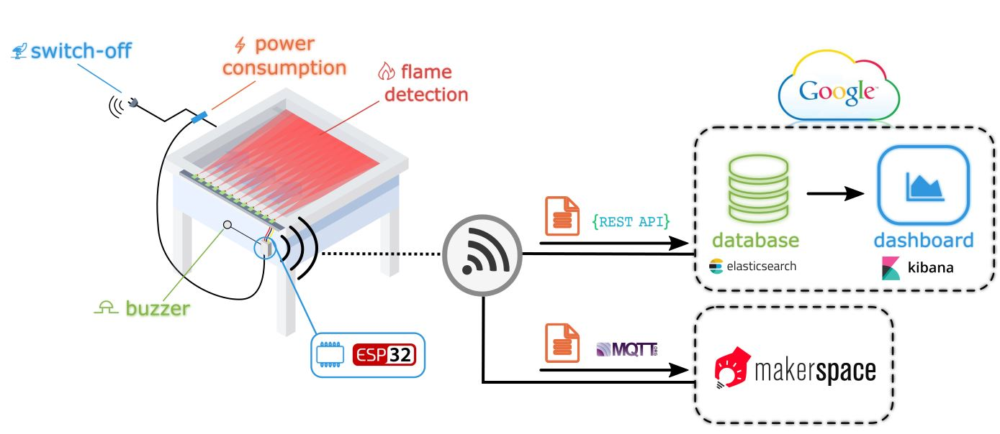
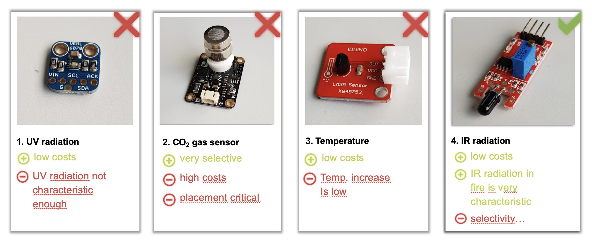
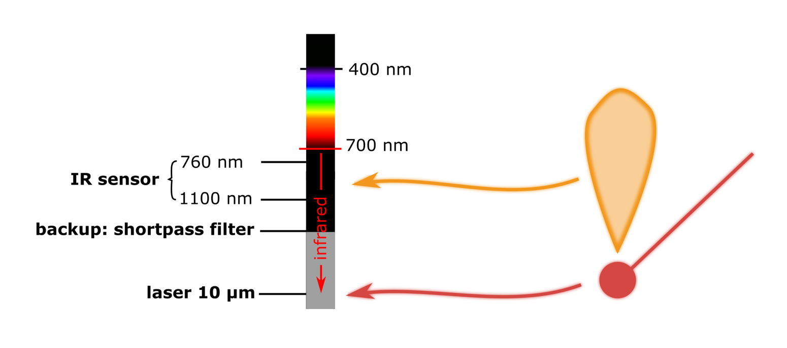
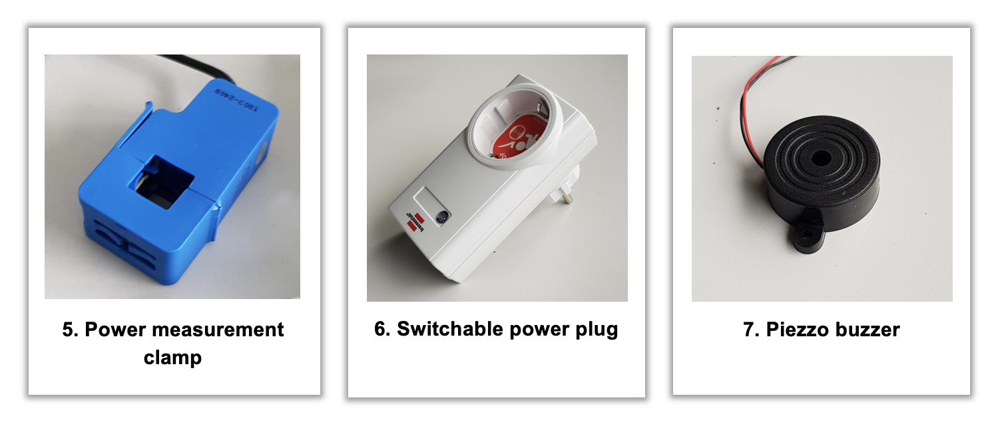
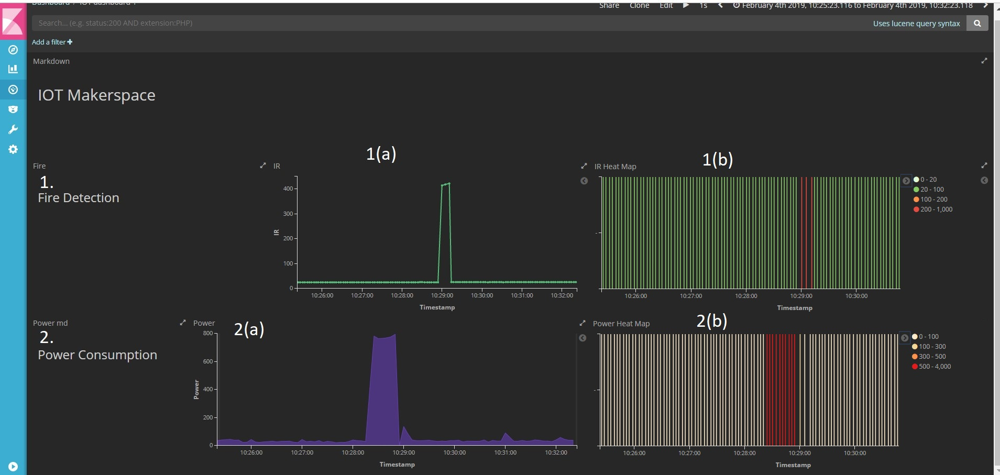

# Fire Detection System for Makerspace's Laser Cutters

## Abstract
The purpose of this project is to enhance an existing laser cutter that is part of [Makerspace](https://www.maker-space.de/Makerspace), which is a high-tech workshop located at the Technical University of Munich. The main issue that could be identified in interviews with the client was that the laser cutter could be set on fire if wrong material is used. Note that even a small fire could result in the destruction of the laser cutter. A lightweight solution is developed by employing IR sensors to identify fire, give an alarm and halt the operation in order to avoid further implications. Moreover, a solution is proposed to track the power consumption of the laser cutter. Finally, a solution could be developed that costs around 85€.

## Table of contents

  1. [Problem Description](#problem)

  2. [Solution](#solution) 

      2.1. [Sensors](#sensors)

      2.2. [Board](#board)

      2.3. [Wiring](#wiring)

      2.4. [Cloud Storage and Dashboard](#dashboard)

      2.5. [MQTT](#mqtt)

  3. [Setup](#setup)
  
  4. [Conclusion & Future Work](#conclusion)

## 1. Problem Description 

The model of the laser cutter ([VLS4.60](https://www.ulsinc.com/products/platforms/vls4-60)) is shown in the following picture:

The device is able to either cut or engrave different kind of materials (https://www.ulsinc.com/explore):

### Problems
In the day-to-day operation of the laser cutter, Makerspace faces the following issues:
* ***Cutted material starts to burn:*** Users sometimes employ materials that are not suitable or increase the laser's intensity above a critical level. Note that Makerspace does not actively track which materials people are using or how the laser is set up. Even a small fire may damage the following two things: 
    * The lens of the laser: 
    
      

    * The honey-comb-shaped surface: 
      
      

<!-- This is already the problem of the previous point! * The laser cutter cannot ***shut down automatically*** in case of fire -->

* The laser cutter does not track the ***power consumption***.

## 2. Solution 

 <figure align="center">
  
  <figcaption>Fig.1: Architecture overview.</figcaption>
</figure> 

An overview of the solution is provided by Figure 1. 
On the left hand side, a sketch of the laser cutter is shown. Twelve infrared (IR) sensors are employed. The sensors are carefully arranged in an array to cover the two-dimensional domain of the laser cutter.
The IR sensors are connected to a box in which a platine wires the microcontroller (ESP32) with the sensors. Besides the IR sensors, a non-invasive current transformer sensor clamp is attached to the ESP32 in order to track the power consumption of the laser cutter. A remotely switchable power plug is used to switch off the laser cutter when fire is detected. The event of a fire activates a buzzer in order to inform people that are close to the laser cutter.

The ESP32 has an integrated network adapter and is able to connect to WiFi. This allows to publish data for various purposes. For instance, data is sent to the Google Cloud platform (more specifically to an Elasticsearch database) that can be queried using Kibana to vizualize a dashboard. Furthermore, the solution is able to send data via the MQTT protocol. This functionality is necessary in order to fulfill the client's specification of monitoring the laser cutter's power consumption. 

In the figure below, one can see the final version of the system. On the left hand side, the array of sensors is depicted. In the middle, one can see the platine. Moreover, the way how the sensors are attached to the laser cutter is shown in the upper right. In the following section, all components are described in further detail.

 <figure align="center">
  
  <figcaption>Fig.2: Final solution.</figcaption>
</figure> 

A video with the prototype can be found [here](https://www.youtube.com/watch?v=C0zWS-e9AV0).

### 2.1. Sensors
This chapter presents and compares the alternative sensors that have been considered when building the proposed solution.

###### Fire detection sensors
 <figure align="center">
  
  <figcaption>Fig.3: Sensor comparison</figcaption>
 </figure> 

  1. **UV radiation sensor:** The first sensor that was tried out is the UV radiation sensor. The result is that it can in general be used but lacks some reliability as the UV radiation is not characteristic enough to detect fire.

  2. **CO2 sensor:** The CO2 sensor is a good solution in terms of selectivity. However, the placement of the sensor is critical as it need to be located in the exhaust gas path that is not reachable without drilling holes in the existing infrastructure.

  3. **Temperature sensor:** The temperature sensor is the weakest solution as temperature changes occur very slowly in the event of a fire.

  4. **IR sensor:** IR is the most reasonable solution. IR sensors are very cheap and the IR radiation of a flame is very characteristic. In Figure 4, the employed sensor is shown [Iduino SE060](https://www.conrad.com/p/infrared-sensor-iduino-se060-1-pcs-33-5-vdc-1485299). The IR sensor has a minimum wavelength of 760 nm and maximum wavelength of 1100 nm. Note that this wavelength range corresponds to the radiation of fire. It is important to mention that this sensors does not detect the laser as it operates at about 10 &micro;m. For the case that a different IR sensor that would be sensitive to the laser is used, a shortpass filter can be considered that blocks wavelengths above 1100 nm in order to block radiation from the laser.
        <figure align="center">
            
            <figcaption>Fig.4: IR sensor</figcaption>
        </figure>

###### Other sensors and actuators

 <figure align="center">
  
  <figcaption>Fig.5: Other sensors and Actuators</figcaption>
 </figure> 

  5. **Power consumption Measurement:** The [Ueetek SCT 013 000](https://www.amazon.de/UEETEK-SCT-013-000-Nicht-invasiver-Wechselstromsensor-Transformer/dp/B072V7RXBM/ref=sr_1_1?ie=UTF8&qid=1548171220&sr=8-1&keywords=sct-013-000) is a non-invasive current transformer sensor (sensor is within the clamp) that measures the amount of power that is provided by the corresponding cable. With this solution it can be avoided to cut cables in terms of an invasive solution. The clamp can simply be attached to an existing positive/negative current cable of an arbitrary device.
  6. **Switchable power plug:** The [Brennenstuhl remote controlable socket](https://www.amazon.de/Brennenstuhl-Funkschalt-Set-Funksteckdosen-Innenbereich-Kindersicherung/dp/B07CGBRS7T/ref=sr_1_1?s=diy&ie=UTF8&qid=1545130783&sr=1-1&keywords=Elro%2BAB440S&th=1) is used to shut down the laser cutter in case of an emergency. The socket is controlled using a [433Mhz wireless transmitter](https://www.amazon.de/dp/B01N5GV39I/ref=psdc_1626220031_t1_B00OLI93IC).
  7. **Piezo Buzzer**: The [96 dB piezo buzzer](https://www.conrad.de/de/kepo-kpi-g4214l-6286-piezo-signalgeber-geraeusch-entwicklung-96-db-spannung-5-v-dauerton-1-st-710753.html) is used to alert the users in case of an emergency. Note that a louder buzzer can be considered if required.

### 2.2 Board
The ESP32 board is used as it is capable of working with a high reliability in industrial environments and can handle temperatures of the environment from –40°C to +125°C. The figure below shows the ESP32 and its pins. This microcontroller has a low power consumption with a combination of several types of proprietary software. It also includes state-of-the-art features, such as fine-grained clock gating, various power modes and dynamic power scaling. Finally, it provides a Wi-Fi functionality that can be used to communicate with the cloud.

<figure align="center">
  
  <figcaption>Fig.6: ESP32-DevKitC.</figcaption>
</figure> 

#####  Analog-to-Digital Converter (ADC):

ADCs are needed because the ADC2 pins of ESP32 cannot be employed when using the built-in Wi-Fi. The MCP3008 (depicted below) is a reasonable choice. It is a 10-bit ADC for the combination of high performance and low power consumption in a small package which makes it ideal for embedded control applications. The MCP3008 features a Successive Approximation Register (SAR) architecture and an industry-standard SPI serial interface, allowing 10-bit ADC capability to be added to the board. The MCP3008 fits to this project as it features 200k samples/second and 8 input channels.

<figure align="center">
  
  <figcaption>Fig.7: MCP3008.</figcaption>
</figure> 

### 2.3 Wiring

In the picture below, one can find a Fritzing breadboard diagram that shows how all the connections of the solution are made.
<figure align="center">
  
  <figcaption>Fig.8: Laser cutter IoT Solution Fritzing Breadboard Diagram.</figcaption>
</figure> 

#### Flame Sensor Setup:

Two MCPs with ESP32 are used to get data from twelve IR sensors as shown in Figure 8. 

##### MCP connections:

| First MCP     | ESP32            | Second MCP    | ESP32                |
| ------------- | ---------------- | ------------- | -------------------- |
| VDD and VREF  | 3.3V             | VDD and VREF  | 3.3V                 |
| AGND and DGND | GND              | AGND and DGND | GND                  |
| CLK           | G14 (HSPICLK)    | CLK           | G18 (VSPICLK)        |
| Dout / MISO   | G12 (HSPIQ)      | Dout / MISO   | G19 (VSPIQ)          |
| Din / MOSI    | G13 (HSPIID)     | Din / MOSI    | G23 (VSPIID)         |
| CS / SS       | G15 (HSPICS0)    | CS / SS       | G5 (VSPICS0)         |
| Channel 0-6   | Flame Sensor 8-2 | Channel 3-7   | Flame Sensor 1, 12-9 |

##### Piezo Buzzer:

| Piezo Buzzer | ESP32 |
| ------------ | ----- |
| VDD          | G21   |
| GND          | GND   |

##### 433 MHz Transmitter:

| Transmitter | ESP32 |
| ----------- | ----- |
| VDD         | 5V    |
| GND         | GND   |
| DATA        | G17   |

#### Current Sensor Setup:

###### Components Required:

- 1 x CT sensor YHDC SCT-013-000
- 1 x Burden resistor 33 Ohms for 5V supply voltage
- 2 x 10k Ohm resistors
- 1 x 10 &micro;F capacitor

The circuit diagram of the current sensor is shown in Figure 9.

<figure align="center">
  
  <figcaption>Fig.9: Laser cutter IoT Solution Fritzing Schema Diagram.</figcaption>
</figure> 

VDD (Red wire in Fig 8) is connected to 5 V, GND (Black wire in Fig 8) to GND and the output (Orange wire in Fig 8) to G33 pin of ESP32.

### 2.4 Cloud Storage and Dashboard

The data recieved from the sensors is sent to an Elasticsearch server hosted on Google cloud. A Kibana dashboard is created to visualize the data from Elasticsearch for monitoring purposes. Kibana is an open source data visualization plugin for Elasticsearch. It provides visualization capabilities on top of the content indexed on an Elasticsearch cluster.

<figure align="center">
    
    <figcaption>Fig.10: Kibana Dashboard.</figcaption>
</figure>

The Dashboard (Fig.10) has two main visualisation components: 
  1. Fire detection, 
  2. Power Consumption   
providing graphical representations of the data gathered for the two main use cases of the proposed solution.
###### Fire Detection
Graph 1(a), is a basic plot of the value from IR sensors w.r.t time. Since, there is an array of sensors used to detect fire, at any given timestamp, the max of the values from all the sensors is used.   
Graph 1(b), is a heat map for the readings of the IR sensors. A value below 100 depicted by green zone indicates that the IR radiations are negligible. A value between 100-200 (orange zone), indicates the presence of a little amount of IR radiations in the environment. A fire is detected only when the value from the sensor is above 200 (red zone). It is worth mentioning that in some cases, a value of >200 is recorded by the sensors, for a short span of time, around 1s, which can be due to the operation of laser cutter itself. It may cause a red spike in the heat map, however, the system accepts it as a normal behavior(as per the information from Makerspace). The system only raises a fire alarm in case the value is above 200 for more than 2s.

###### Power Consumption
Graph 2(a), is a map of power consumed by the system (Laser cutter) in watts, per timestamp. It can be used to monitor the power usage over a period of time and also detect anomalies in power consumption patterns.
Graph 2(b), is a heat map for the values of the power sensor. For the test setup, a value above 500 watts indicates the system is in functional mode (red zone). The ranges for the zones may have to be calibrated according to the environment of the system.  

###### Auto-refresh 

The dashboard consumes the data in real time and auto-refreshes every 5 seconds. The time period can be adjusted, to view historic data or to view data over a lager timespan (i.e. last 1 hour, last 4hours ,etc.). The auto-refresh interval can also be adjusted according to the requirements.

### 2.4 MQTT

The data from sensors is sent to the Makerspace MQTT broker by utilizing PubSubClient library available for ESP32.
In order to connect to Makerspace network, the device needs to be authenticated. To authenticate, the Makerspace team has to allow the MAC address of the microcontroller (ESP32). For sending data we use the 1-UTUM-IOT network in the Makerspace. Details of MQTT broker is given below:

* IP - 10.25.172.52
* Username - 'iotproxy'
* Port - 1883

Currently, data is being posted to test/ESP32 topic. It is only concerned by sending data to MQTT broker, further handling of data i.e., receiving it at the server side and then forwarding it to Makerspace own database or integrating with SAP platform is to be completed by Makerspace team. When deploying, the the topic name in the source code should be adapted to the Makerspace data model (if Makerspace decides to receive at any topic other than test/ESP32). Also, they will need to authorize the MAC address of the new microcontroller. The password of the network is hardcoded for now in the source code and for security reasons it is not mentioned in this document.

## 3. Setup

The case can be set up by considering the following steps:

  1. Clean the surface where you intend to attach the IR sensors
  2. Stick the IR sensors to the surface and hold a moderate pressure for about 5 minutes
  3. Attach the board
  4. Plug the board to a power source
  5. Plug the laser cutter into the smart socket
  6. Attach the [power measurement clamp](#clamp) to the "+" or "-" cable of the main power cable of the device (one can use an adapter cable to avoid cutting the isolation of the laser cutter power cable)
  6. Make sure the MAC address of the ESP32 WLAN adapter is accepted by the Makerspace firewall

## 4. Conclusion & Future Work
At the beginning of the project, several sensors were considered to find the best sensors that meet the requirements of this project. A solution has been developed that is implementable in a laser cutter of the Makerspace workshop. In addition, the data is evaluated in a dashboard and can be sent to the Makerspace's data broker. It is important to note that the solution should be thoroughly tested in terms of fire detection. A critical point is that the IR sensors should be calibrated both in the threshold of IR radiation that is exceeded in the event of a fire and in the time it takes to reach a certain threshold before an alarm is triggered.

In conclusion, the project objectives are achieved as a functioning product is developed that meets the customer's specifications.

<!-- Through our solution we not only completed our 5 tasks (Setting up sensor support, sending sensors data to multiple recipients, applying sensor setup to laser cutter, transmitting the data to cloud platform and developing a dashboard concept) but built a fully functional (robust) solution that is ready to be tested in the field. 

Cost is an important factor, so we optimized and came out with a solution that amounts as little as 85€. We hope that the makerspace will consider testing our solution and implementing it in the laser cutter.-->

